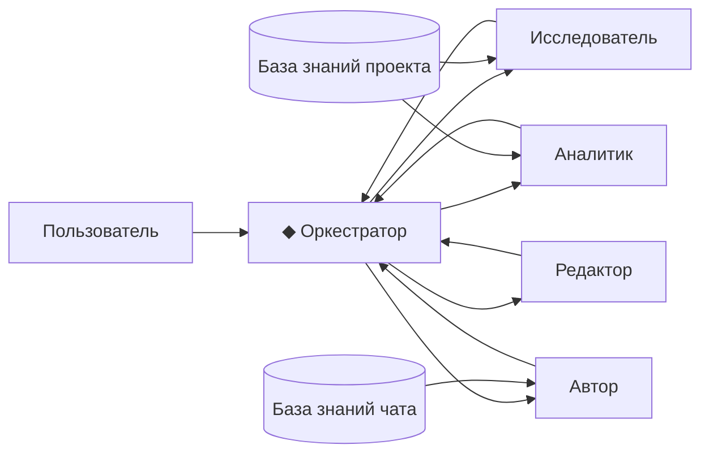
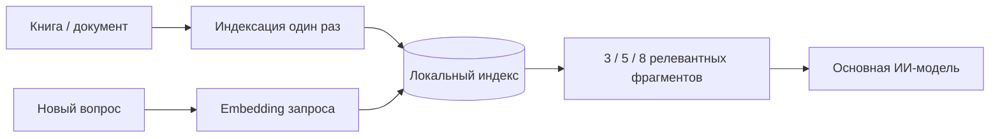
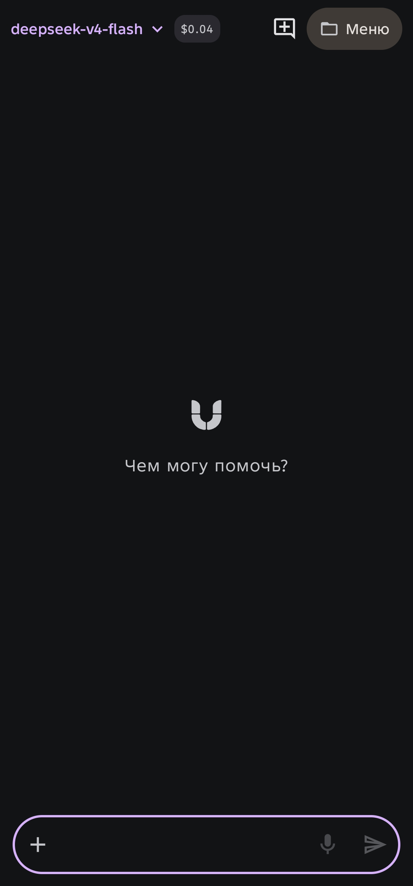
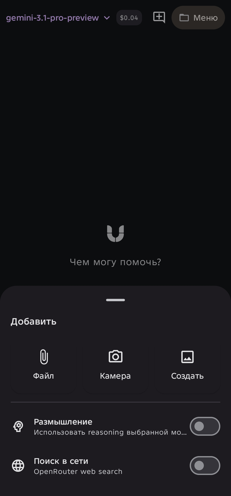
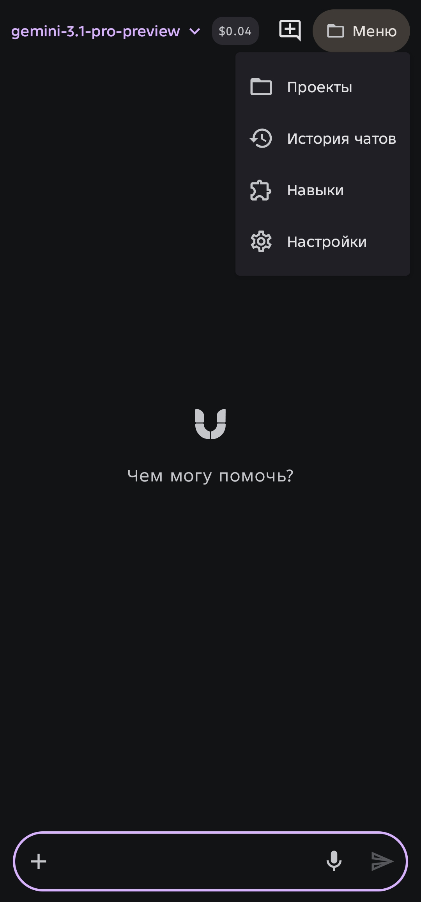
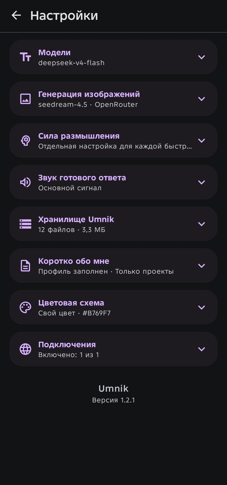

# Umnik

**Мобильная среда для создания и управления командой ИИ-специалистов на Android.**

[](https://github.com/Ayuemin/Umnik/actions/workflows/android-ci.yml)
[](https://github.com/Ayuemin/Umnik/releases/latest)
[](LICENSE)

Umnik позволяет собирать внутри одного проекта несколько специализированных ИИ-чатов. У каждого могут быть свои модель, роль, инструкции, навыки, инструменты, файлы, этапы работы и собственная база знаний. Чат **◆ Оркестратор** принимает задачу обычным человеческим языком, запускает нужных исполнителей, передаёт между ними результаты и файлы и помогает вести многоходовую работу без ручного копирования контекста.

Текущая версия: **1.15.3**.

**[Скачать последний стабильный релиз](https://github.com/Ayuemin/Umnik/releases/latest)**

## Что такое Umnik

Umnik начинался как Android-клиент для OpenRouter, но постепенно вырос в рабочую среду для проектов с несколькими ИИ-специалистами.

Вместо одного универсального чата можно создать, например:

- **Исследователя** с веб-поиском и своей моделью;
- **Аналитика** с усиленным reasoning;
- **Автора** с отдельным стилевым навыком;
- **Редактора** с собственными правилами проверки;
- **Дизайнера** с книгами по UX/UI в базе знаний;
- **◆ Оркестратора**, который связывает их в одну рабочую цепочку.



Главная идея проста: **модель - это только одна часть специалиста**. В Umnik специалист складывается из модели, роли, инструкций, навыков, инструментов, истории, файлов и базы знаний.

## ◆ Оркестратор

Каждый проект автоматически получает защищённый чат **◆ Оркестратор**.

Это разговорный пульт управления проектом. Необязательно вручную составлять сценарий из кнопок. Можно написать обычной фразой:

> Пусть Исследователь найдёт пять свежих вариантов с веб-поиском, потом передай результат Проверяющему, а после этого Автору - пусть подготовит итоговый текст.

Оркестратор может:

- выполнить конкретный чат с новым промптом;
- последовательно запустить несколько чатов;
- передать результат одного исполнителя следующему;
- запустить индивидуальные этапы чата;
- запустить общие этапы проекта;
- показать последний результат выбранного чата без нового запроса к модели;
- вернуть результат исполнителю на доработку;
- передавать файлы между чатами проекта;
- временно переопределить для отдельного запуска модель, поиск, reasoning и навыки;
- изменить постоянные настройки чата только по явной команде пользователя;
- сохранить обычную линейную и контролируемую человеком логику выполнения.

В текущей реализации Оркестратор сознательно **не запускает бесконечные циклы и автономные if/else-сценарии**. Цель - удобная управляемая многоходовая работа, а не неконтролируемый суперагент.

Подробнее: [docs/ORCHESTRATOR.md](docs/ORCHESTRATOR.md).

## Базы знаний и RAG

У проекта и у каждого отдельного чата может быть собственная **База знаний**.

Она предназначена для книг, справочников, документации, методичек и других больших источников, которые невыгодно отправлять модели целиком при каждом сообщении.

Схема работы:

1. документ добавляется в базу один раз;
2. Umnik разбивает текст на фрагменты;
3. embeddings создаются через OpenRouter;
4. текст фрагментов, векторы и индекс сохраняются локально на устройстве;
5. при новом вопросе Umnik ищет самые близкие по смыслу фрагменты;
6. основной модели передаются только найденные части документа.



Это позволяет дать, например, чату **Дизайнер** несколько профессиональных книг и использовать их как постоянную специализированную библиотеку без повторной отправки всей книги в контекст.

Поддерживаются:

- PDF с текстовым слоем;
- EPUB;
- DOCX;
- TXT и Markdown;
- HTML и XML;
- JSON, CSV и YAML;
- текстовые файлы кода.

Для PDF сохраняется номер страницы найденного фрагмента. Сканированные PDF без текстового слоя пока требуют отдельного OCR и в текущей версии не индексируются как текстовая база знаний.

Можно выбрать embedding-модель, включить или отключить автоматический поиск, выбрать 3, 5 или 8 фрагментов на запрос, переиндексировать источник другой моделью или удалить его.

Подробнее: [docs/KNOWLEDGE_BASE.md](docs/KNOWLEDGE_BASE.md).

## Проекты

Проект объединяет рабочий контекст вокруг одной задачи:

- несколько специализированных чатов;
- ◆ Оркестратор;
- общую мастер-инструкцию;
- общие файлы;
- общие навыки;
- общую базу знаний;
- последовательные этапы работы.

При этом каждый чат проекта остаётся самостоятельным специалистом и может иметь собственные:

- модель;
- reasoning и его силу;
- веб-поиск;
- инструменты OpenRouter;
- навыки;
- постоянные файлы;
- базу знаний;
- роль и мастер-инструкцию;
- историю диалога;
- индивидуальные этапы.

Это позволяет разделять работу по ролям вместо того, чтобы постепенно превращать один длинный чат в смесь исследователя, автора, программиста и критика.

Подробнее: [docs/PROJECTS.md](docs/PROJECTS.md).

## Пример: мини-редакция

Создайте проект и четыре рабочих чата:

**Исследователь** - ищет факты и первоисточники, веб-поиск включён.

**Отборщик** - отбрасывает слабые и неподтверждённые варианты.

**Автор** - пишет материал с нужным стилевым навыком.

**Редактор** - проверяет текст, находит слабые места и фактические провалы.

После настройки можно работать почти только через ◆ Оркестратор:

> Исследователь пусть найдёт восемь интересных программ по теме. Отборщик оставит три лучших. Результат передай Автору и попроси написать статью.

А после чтения результата:

> Не нравится вступление. Передай статью Редактору, пусть объяснит проблемы первых абзацев. Затем верни его замечания Автору и попроси переписать только начало.

Истории исполнителей остаются раздельными, а Оркестратор связывает их в единую работу.

## Пример: разработка приложения

Проект можно собрать из чатов **Архитектор**, **Разработчик**, **Ревьюер**, **UX** и **Исследователь**.

Задача Оркестратору:

> Архитектор пусть предложит реализацию импорта документов. Исследователь проверит актуальные ограничения Android. Оба результата передай Разработчику, а его решение затем Ревьюеру.

Если Ревьюер нашёл проблему, не нужно повторять всю цепочку:

> Передай замечания Ревьюера Разработчику и попроси исправить только найденные проблемы.

## Основные возможности

Помимо проектов, Оркестратора и баз знаний, Umnik поддерживает:

- OpenRouter `chat/completions` и каталог моделей;
- подключение OpenAI-совместимых провайдеров;
- быструю смену текстовой модели внутри чата;
- Vision для совместимых моделей;
- генерацию изображений;
- reasoning;
- web search;
- OpenRouter server tools;
- Speech / TTS и Transcription / STT;
- локальную Android Text-to-Speech;
- фоновые Video-задачи;
- Batch для независимых задач;
- Shell для вычислений и временных файлов;
- обычные embeddings / RAG / rerank-инструменты OpenRouter;
- локальные навыки из текстовых файлов и `SKILL.md`;
- файлы проекта, постоянные файлы чата и разовые вложения;
- ветвление разговора от выбранного сообщения;
- локальное хранилище созданных файлов;
- Markdown;
- избранные чаты и проекты;
- Material 3 / Material You и пользовательский Accent Color;
- расширенную диагностику и экспорт технических логов;
- встроенную локальную памятку для новичка.

Поддержка reasoning, изображений, аудио, видео, tools и других возможностей зависит от конкретной модели и провайдера.

## Чем отличаются файлы и база знаний

В Umnik это разные механизмы.

**Постоянный файл** нужен, когда модель должна видеть документ как обычный рабочий контекст. Это удобно для коротких инструкций, текущего ТЗ, небольших таблиц и файлов, которые действительно нужно передать целиком.

**База знаний** нужна для больших материалов. Книга или справочник индексируются один раз, а в запрос попадают только наиболее подходящие фрагменты.

Поэтому короткую инструкцию разумно держать постоянным файлом, а книгу на сотни страниц - в базе знаний.

## Этапы работы

Проект и отдельные проектные чаты могут иметь собственные последовательные этапы.

Каждый этап выполняется отдельным запросом. Следующий этап получает результаты предыдущих. При необходимости этап может использовать другую модель, свои вложения и выбранные чаты проекта как дополнительные источники контекста.

Этапы подходят для заранее известного процесса. Оркестратор удобнее, когда последовательность хочется сформулировать обычной фразой прямо во время работы.

## Batch

Batch предназначен для **независимых** задач, которые не должны передавать результат друг другу.

Для последовательной зависимой работы используйте этапы проекта или ◆ Оркестратор.

## Скриншоты

<p align="center">
  
  
  <br>
  
  
</p>

> Эти скриншоты относятся к ранней версии интерфейса. Актуальные скриншоты проекта, Оркестратора и баз знаний будут добавлены отдельно.

## Установка

**[Скачать последний стабильный релиз Umnik](https://github.com/Ayuemin/Umnik/releases/latest)**

В Assets официального релиза публикуются:

- `Umnik-vX.Y.Z.apk` - установочный APK;
- `Umnik-vX.Y.Z.apk.sha256` - SHA-256 APK;
- `Umnik-signing-certificate-sha256.txt` - отпечаток постоянного release-сертификата.

Требования:

- Android 8.0+;
- доступ к сети;
- собственный API-ключ нужного провайдера;
- для OpenRouter-функций и баз знаний - API-ключ OpenRouter.

Для начала работы с OpenRouter откройте **Настройки → OpenRouter**, сохраните API-ключ и проверьте подключение. Затем выберите необходимые модели в настройках каталога моделей.

### Постоянная подпись

Начиная с v0.7.0 официальные GitHub Releases подписываются постоянным release-ключом Umnik. Подпись APK проверяется автоматически в GitHub Actions.

SHA-256 сертификата постоянной подписи:

`bc0c8bfe9031c29fc3148fdc52c1cb84d897682b83af73e37f3af670f047d79e`

## Приватность

Umnik не содержит собственного облачного аккаунта и встроенного API-ключа автора. Пользовательские ключи хранятся локально в приватном хранилище приложения и защищаются Android Keystore.

При обычных запросах данные отправляются выбранному провайдеру. При индексации базы знаний текстовые фрагменты отправляются в OpenRouter для вычисления embeddings, после чего исходник, фрагменты, векторы и индекс хранятся локально. При поиске по базе в OpenRouter отправляется текст поискового запроса для получения embedding, а основной модели затем передаются только найденные фрагменты.

Подробнее: [PRIVACY.md](PRIVACY.md).

## Сборка

Стек:

- Kotlin;
- Jetpack Compose;
- Material 3;
- OkHttp;
- Gson;
- Apache PDFBox Android;
- Android minSdk 26, targetSdk 36.

Для локальной debug-сборки нужен JDK 17, Android SDK и Gradle 8.13:

```bash
gradle :app:assembleDebug
```

Локальный `assembleRelease` без release-ключа не является официальной публичной сборкой. Официальные APK собираются GitHub Actions с постоянным ключом проекта.

## Релизы

Обычные push в `main` запускают CI, но не публикуют новый APK автоматически.

Официальный релиз использует тег `vX.Y.Z`, совпадающий с `versionName`. Workflow **Android Release** выполняет тесты, собирает подписанный APK, проверяет сертификат и публикует GitHub Release.

История пользовательских изменений: [CHANGELOG.md](CHANGELOG.md).

## О проекте

Проект создан Александром ([@Ayuemin](https://github.com/Ayuemin)) в соавторстве с ChatGPT от OpenAI. Александр определяет идею, требования, UX и тестирует приложение; ChatGPT участвует в проектировании, реализации, отладке и документации.

Это описание совместной разработки и не означает, что OpenAI является владельцем, издателем или спонсором проекта.

## Лицензия

Проект распространяется по **GNU GPL v3 or later**. См. [LICENSE](LICENSE).
